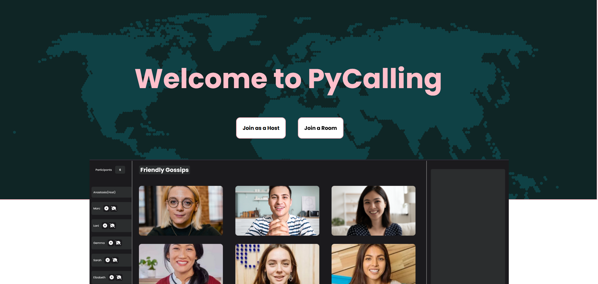
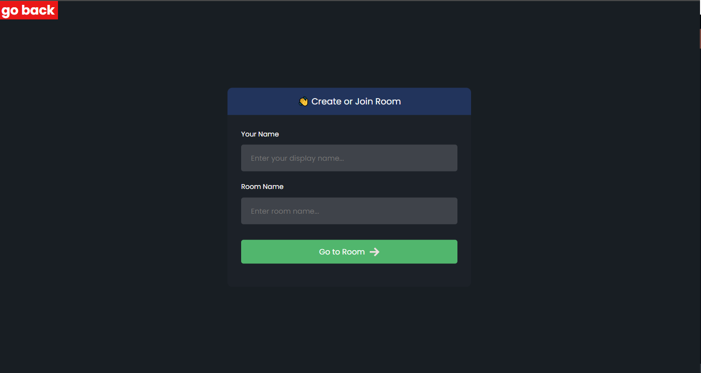
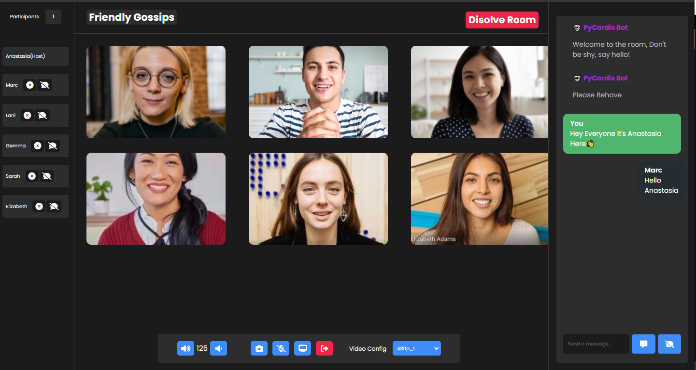
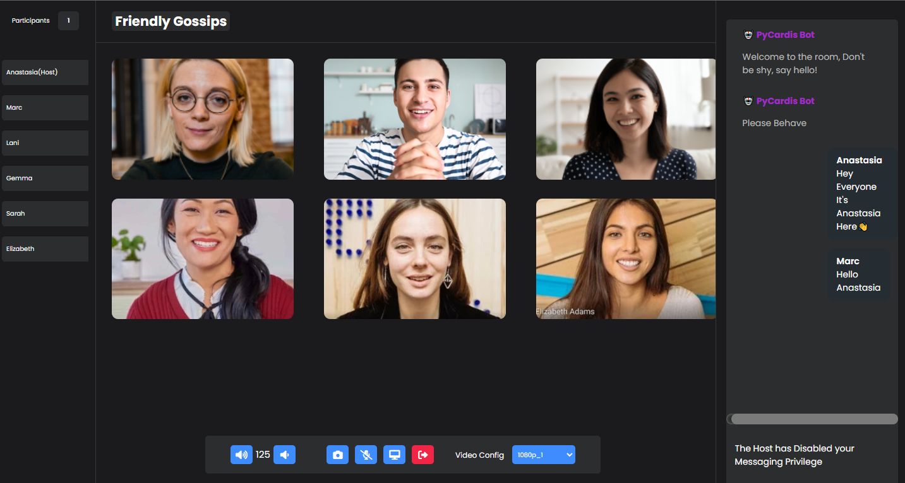

# PyCalling-Video Calling/Conferencing App
---
### Tools Used
* ReactJS
* Redux
* Django
* Agora Web Video SDK
* Agora RTM-React
## Prerequisites

- Node.js 6.9.1+


## Quick Start

This section shows you how to prepare, build, and run the sample application.

- [Create an Account and Obtain an App ID](#create-an-account-and-obtain-an-app-id)
- [Update and Run the Sample Application](#update-and-run-the-sample-application) 


### Create an Account and Obtain an App ID
To build and run the sample application, you must obtain an app ID: 

1. Create a developer account at [agora.io](https://dashboard.agora.io/signin/). Once you finish the sign-up process, you are redirected to the dashboard.
2. Navigate in the dashboard tree on the left to **Projects** > **Project List**.
3. Copy the app ID that you obtained from the dashboard into a text file. You will use this when you launch the app.


### Update and Run the Sample Application 

1. Edit the [`src/settings.js`](src/settings.js) file. In the `AGORA_APP_ID` declaration, update `Your App ID` with your app ID.

```JavaScript
export const AGORA_APP_ID = 'Your App ID'
```

2. Download the [Agora Web Video SDK](https://www.agora.io/en/download/). Unzip the downloaded SDK package and copy the `AgoraRTC-*.js` file into the sample application's `/src/library/` folder. Rename the file to `AgoraRTC.js`.

	**Note:** CDN can now be used to retrieve the latest SDK. You do not have to re-download SDK updates.
		
3. Open the terminal and navigate to your project folder.

``` bash
cd path/to/project
```

4. Use `npm` to install the dependencies:

``` bash
# install dependency
npm install
npm i agora-rtc-sdk-ng
npm i agora-rtm-sdk
```

5. Build and run the project:

Use `npm run start` for a local build. View the application in your browser with the URL `http://localhost:3000`


```bash
# serve with hot reload at localhost:3000
npm run start
```
6. Host Registration and Login
*  [Host Registration](https://pycallingbackend-production.up.railway.app/api/register/)
*  [Host Login](https://pycallingbackend-production.up.railway.app//api/token/)
*  click 'Join as a Host' to enter room as a host

Use `build` for a production version with minification.

```bash
# build for production with minification
npm run build
```
## Preview 
---


---
## Host View

## Normal View

## Video 
[!Video Preview](https://www.youtube.com/watch?v=CNJ3SwTHBq0)

## Features:-
* Anonymous Messaging 
* Toggle User Chat
* Change Video Configuration
* Change Volume Level
* Kick Out Unwanted Users

## References:-
* [Dennis Ivy](https://www.youtube.com/watch?v=QsH8FL0952k "Dennis Ivy webRTC tut")
* [Agora IO](https://www.agora.io/en/blog/muting-and-unmuting-a-remote-user-in-a-video-call-web "Mute and Unmute Users")
* [Agora RTM](https://agoraio-community.github.io/Agora-RTM-React/)
