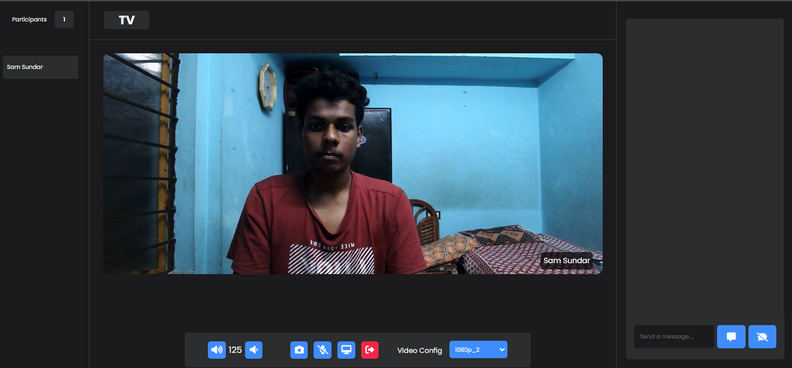
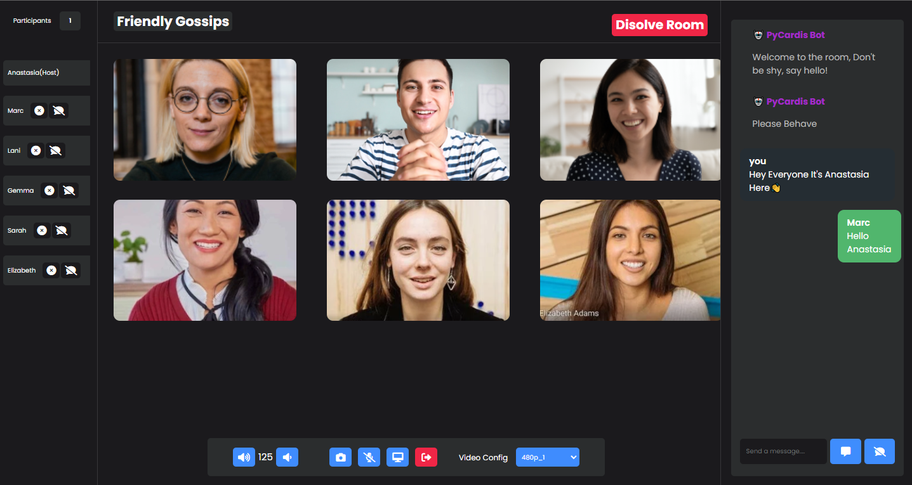

# PyCalling-Video Calling/Conferencing App
---
### Tools Used
* ReactJS
* Django
* Agora SDK
## Preview 
---

---
## Normal View

## Features:-
* Anonymous Messaging 
* Toggle User Chat
* Change Video Configuration
* Change Volume Level
* Kick Out Unwanted Users

## References:-
* [Dennis Ivy](https://www.youtube.com/watch?v=QsH8FL0952k "Dennis Ivy webRTC tut")
* [Agora IO](https://www.agora.io/en/blog/muting-and-unmuting-a-remote-user-in-a-video-call-web "Mute and Unmute Users")